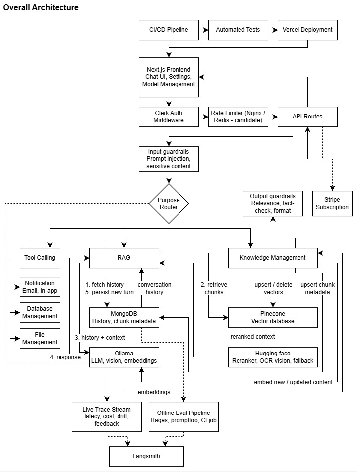
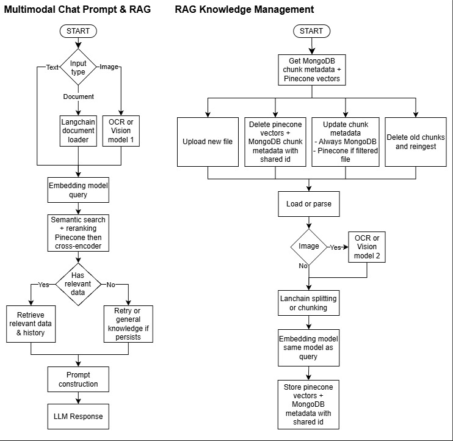

# Multimodal AI Chatbot Documentation (Draft)

## 1. Overview
This application is a full-stack, multimodal AI chatbot platform built on Next.js. It goes beyond a simple chat UI by combining:

- **Retrieval-Augmented Generation (RAG)** over a user-managed knowledge base (Pinecone + MongoDB metadata)
- **Tool calling** for scoped agentic actions (data orchestration, data analysis, ML/numerical analysis, file management, notifications, diagram/visualization generation)
- **Guardrails** applied inline/in real time across security, relevance, content integrity, language quality, and logic/functionality checks
- **Monitoring** of live request traces (quality, latency, cost, drift, user feedback)
- **Evaluation** as an offline/batch/CI pipeline (LLM-as-a-judge scoring, hallucination/regression detection)

The system is orchestrated with LangGraph/LangChain, served by Ollama (with Hugging Face as a secondary/fallback model source), and deployed on Vercel with Clerk-based authentication and Stripe-based subscription billing.

**Primary users**: individuals or small teams who want a private, extensible chat assistant that can reason over their own documents/images and safely perform bounded actions on their behalf.

## 2. Tech Stack
| Tool                                                | Role in this app                                                                                    |
|-----------------------------------------------------|-----------------------------------------------------------------------------------------------------|
| Next.js (App Router) + React + TypeScript           | Full-stack web application framework — frontend UI and API routes                                   |
| shadcn/ui + Radix UI                                | Accessible, composable UI components (dialogs, dropdowns, scroll areas, etc.)                       |
| Clerk                                               | User authentication (signup, login, session management, webhooks for user lifecycle)                |
| Stripe                                              | Subscription billing and plan management                                                            |
| MongoDB + Prisma ORM (v6)                           | Primary application database — users, conversations, messages, models, tool/guardrail/eval metadata |
| Pinecone                                            | Vector database for storing embeddings and running semantic search over the knowledge base          |
| Ollama                                              | Local LLM serving — chat, vision, and embedding models                                              |
| Hugging Face                                        | Fallback/secondary model hosting — embeddings, reranker, OCR/vision models                          |
| `bge-reranker-base` (sentence-transformers, via HF) | Cross-encoder reranking of retrieved chunks after Pinecone similarity search                        |
| LangChain                                           | Document loaders, chunking/splitting, chain and tool interfaces                                     |
| LangGraph                                           | Orchestrates conversation flow, RAG retrieval, and tool-call routing as a state graph               |
| LangSmith                                           | Evaluation and tracing — tracks LLM runs for offline scoring                                        |
| RAGAS                                               | RAG-specific evaluation metrics (faithfulness, relevance, hallucination)                            |
| Promptfoo                                           | Prompt/model regression testing in CI                                                               |
| Nginx / Redis (planned)                             | Rate limiting for LLM and tool-call endpoints                                                       |
| NeMo Guardrails / Guardrails AI / Llama Guard       | (Future) Dedicated guardrails frameworks to replace custom inline validators at scale               |
| Vault / Doppler                                     | (Future) Secrets management                                                                         |
| Kafka-style event bus (future)                      | Async event handling for scaling beyond single-tenant use                                           |
| ngrok                                               | Exposes local dev environment publicly (e.g., for Clerk/webhook callbacks, local Ollama access)     |
| Vercel                                              | Hosting and deployment platform for the Next.js app                                                 |
| GitHub Actions (assumed)                            | CI/CD pipeline — tests and evaluation gating before deploy                                          |

## 3. Features
### 3.1 User Management
- Signup
- Authentication via Clerk (with ngrok used for public/webhook-reachable hosting during development)
- Stripe integration for subscriptions/billing
- Login
- Deactivate account

### 3.2 Model Management
- Add, Search, Edit, Delete AI models (Ollama model references, validity flag)

### 3.3 Chat Prompt
- Text messages
- System prompt and generation parameters (`top-p`, `top-k`, `temperature`, `num_ctx`)
- Upload image or document attachments

### 3.4 Knowledge and Tool Management
- **Knowledge (RAG)**: manage Pinecone-backed documents — add, reingest, update metadata, delete
- **Tool calling**: define a tool's name and the action it maps to via a configurable input prompt, plus a test/dry-run capability
- **Tool scope is intentionally bounded** to:
  1. Data and table analysis
  2. Machine learning / other numerical analysis
  3. File management
  4. Notification actions (e.g., email)
  5. Visualization (diagram generation)

### 3.5 LLM, RAG, and Tool-Calling Infrastructure
- **Orchestration**: LangGraph (control flow) + LangChain (document loading, chunking, retrieval)
- **Model serving**: Ollama (primary), Hugging Face (secondary/fallback and for specialized models)
- **Evaluation tooling**: LangSmith, Ragas, promptfoo
- **Reranking**: `bge-reranker-base` via `sentence-transformers`, served through a Hugging Face-hosted path
- **Rate limiting**: candidate stack of Nginx / Redis
- *(Longer-term)* Dedicated guardrails frameworks (NeMo Guardrails, Guardrails AI), Llama Guard plus custom delimiting/validation
- *(Longer-term)* Secrets management (Vault/Doppler), service mesh, Kafka-style event bus

### 3.6 Message Management
- **Message bubble**: streamed "thinking" process display, Markdown rendering, LaTeX/math formatting
- **Message list**: Add, Search, Edit, Delete; scroll-to-latest
- **Conversations**: Add, Search, Rename, Delete

### 3.7 Settings
- **Guardrails (inline/real-time)**, grouped as:
  - *Security & privacy*: inappropriate content, offensive language, prompt injection, sensitive content
  - *Response & relevance*: relevance check, prompt-address confirmation, URL availability, fact-check
  - *Content validation & integrity*: competitor-mention blocking, price-quote validation, source/context grounding, gibberish detection
  - *Language quality*: response quality scoring, translation accuracy, duplicate-sentence detection, readability level
  - *Logic & functionality*: SQL query validation, OpenAPI response validation, logic-flow validation, JSON format validation
- **LLM engineering controls**: loop engineering, harness engineering, context engineering, prompt engineering
- **Display and language** preferences
- **Subscription** management (Stripe "Plus" tier)

### 3.8 Monitoring (async / live)
- Streams request traces to track quality trends, latency, cost, model/data drift, and user feedback asynchronously.

### 3.9 Evaluation (offline / batch / CI)
- Runs scoring functions (e.g., LLM-as-a-judge) to measure accuracy, hallucination rate, and regressions across prompt or model changes, as part of a CI pipeline.

### 3.10 DevOps
- CI/CD pipeline
- Automated tests
- Deployment on Vercel

## 4. Database Table Fields
### 4.1. User
- id, clerkId, email, name, conversations, models, createdAt

### 4.2. Conversation
- title, user, userId, messages, createdAt, updatedAt

### 4.3. Message
- id, conversation, conversationId, role, content, attachment, createdAt, updatedAt

### 4.4. Attachment
- url, fileName, fileType, mimeType, size

### 4.5. AiModel
- id, name, modelId, description, user, userId, isValid, createdAt, updatedAt

### 4.6. Subscription
- id, user, userId, stripeCustomerId, stripeSubscriptionId, plan (free/plus), createdAt, updatedAt

### 4.7. Notification
- id, user, userId, type (system/billing/tool_result), title, body, isRead, createdAt

### 4.8. System Prompt Preset
- id, user, userId, name, systemPrompt, temperature, topP, topK, numCtx, isDefault, createdAt, updatedAt

### 4.9. Knowledge Document
- multimodal: id, user, userId, fileName, fileType, mimeType, size, sourceUrl, status, chunkCount, createdAt, updatedAt, chunks
- text: 

### 4.10. Knowledge Chunk
- id, document (KnowledgeDocument), documentId, pineconeId, chunkIndex, text, metadata, createdAt

### 4.11. Tool
- id, user, userId, name, scope (orchestration/data_analysis/ml_numerical/file_management/notification/visualization), description, actionPrompt, isEnabled, createdAt, updatedAt

### 4.12. Tool Test Run
- id, tool, toolId, input, output, success, errorMsg, createdAt

### 4.13. Guardrail Config
- id, user, userId, category (security_privacy/response_relevance/content_integrity/language_quality/logic_functionality), ruleKey (prompt_injection/fact_check/json_format_validator), isEnabled, threshold, updatedAt

### 4.14. Guardrail Flag
- id, message, messageId, ruleKey, severity, detail, createdAt

### 4.15. Request Trace (Monitoring or live traces)
- id, conversationId, messageId, userId, modelId, latencyMs, inputTokens, outputTokens, costUsd, feedback (up/down/null), toolCalls, ragHit, createdAt     

### 4.16. Evaluation Run
- id, label, datasetRef, modelId, triggeredBy (manual/CI), status (running/completed/failed), createdAt, completedAt, results  

### 4.17. Evaluation Result
- id, run (EvaluationRun), runId, metric, score, sampleId, detail, createdAt

**Notes**
- `KnowledgeChunk.pineconeId` is the shared key linking a MongoDB metadata row to its Pinecone vector, matching the "shared id" pattern already shown in the architecture diagram for delete/update-after-filter operations.
- `GuardrailFlag` and `RequestTrace` are both keyed off `Message`/`Conversation`, so guardrail outcomes and monitoring metrics can be joined per turn.
- `EvaluationRun` / `EvaluationResult` are intentionally decoupled from live traffic tables since evaluation runs offline/batch/CI against a fixed dataset, not live user messages.

## 5. Architecture
### 5.1. Overall Architecture

### 5.2. Sub Architecture

## 6. Setup Instructions
### 6.1. Next.js setup
- CLI run: npx create-next-app@latest my-next-app
- or npm create next-app@latest my-next-app

### 6.2. Prisma setup
a. prisma v6 install
- cd (nextjs proj)
- npm install prisma@6.19.0 @prisma/client@6.19.0 --save-exact
- v7 doesnt have mongodb yet
b. npx prisma init
c. npx prisma generate
d. npx prisma db push

### 6.3. Ollama setup
- install ollama desktop
- npm install ollama
- launch ollama or ollama serve

### 6.4. Clerk
- In dashboard.clerk.com API keys, find NEXT_PUBLIC_CLERK_PUBLISHABLE_KEY and CLERK_SECRET_KEY 
- In dashboard.clerk.com developers webhooks, find CLERK_WEBHOOK_SIGNING_SECRET

### 6.5. Ngrok setup
- Sign up free at https://dashboard.ngrok.com/signup
- Grab your authtoken from https://dashboard.ngrok.com/get-started/your-authtoken
- Run powershell command: ngrok config add-authtoken YOUR_TOKEN_HERE
- Run powershell command: ngrok http 3000
- Open: https://trance-ankle-unsaddle.ngrok-free.dev/

### 6.6. Other installations
- refer to requirements.txt, package.json
- npm install -i

### 6.7. Run the development server
- (npm run/yarn/pnpm/bun) dev

### 6.8. Deploy on Vercel
The easiest way to deploy your Next.js app is to use the [Vercel Platform](https://vercel.com/new?utm_medium=default-template&filter=next.js&utm_source=create-next-app&utm_campaign=create-next-app-readme) from the creators of Next.js.
Check out our [Next.js deployment documentation](https://nextjs.org/docs/app/building-your-application/deploying) for more details.

## 7. Open Items (not yet discussed in detail)
- Exact tool-calling execution sandbox/security model (how a tool's "action prompt" maps to real, safely-bounded code execution)
- Guardrail enforcement mechanics: which checks run synchronously (blocking) vs asynchronously (logged only), and what happens on a block (retry, refuse, redact)
- Rate limiting strategy and limits (per-user, per-plan, per-endpoint)
- Notification delivery implementation (email provider, in-app push mechanics)
- Stripe plan/tier definitions and feature gating logic
- Dedicated guardrails framework adoption (NeMo Guardrails vs Guardrails AI vs custom + Llama Guard)
- Secrets management approach (Vault/Doppler) and rotation policy
- Service mesh / Kafka-style event bus — whether and when these are actually needed given current scale
- Evaluation dataset curation and versioning process
- LangSmith vs self-hosted tracing trade-offs and data retention policy
- Multi-tenant / team accounts (currently single-user-owned models, tools, and knowledge)
- Attachment storage backend details (current `Attachment` type has a `url` — origin of that URL, e.g., S3/Vercel Blob, not yet specified)
- Loop/harness/context/prompt engineering settings — what these controls concretely expose to the user